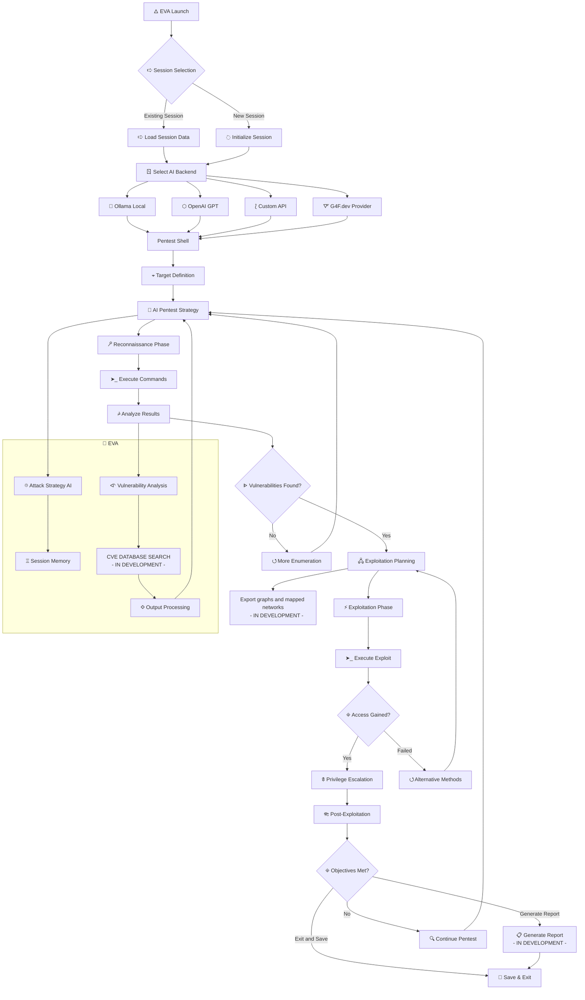

<div align="center">

# ⫻ 𝝣.𝗩.𝝠 
## ⮡ Exploit Vector Agent  
<br>

**Autonomous offensive security AI for guiding pentest processes**

[](https://github.com/ARCANGEL0/EVA)
[](https://github.com/ARCANGEL0/EVA)
[](https://github.com/ARCANGEL0/EVA/fork)
[](https://github.com/ARCANGEL0/EVA)

[](LICENSE)
[](#)
[](#)


</div>

---

## 𝝺 Overview

**EVA** is an AI penetration testing agent that guides users through complete pentest engagements with AI-powered attack strategy, autonomous command generation, and real-time vulnerability analysis based on outputs. The goal is not to replace the pentest professional but to guide and assist and provide faster results.

### Main funcionalities

- **🜂 Intelligent Reasoning**: Advanced AI-driven analysis and attack path identification depending on query.
- **ⵢ Automated Enumeration**: Systematic target reconnaissance and information gathering based on provided target.
- **ꎈ Vulnerability Assessment**: AI-powered vulnerability identification and exploitation strategies, suggesting next steps for vulnerability or OSINT.
- **⑇ Multiple AI Backends**: Support for Ollama, OpenAI GPT, G4F.dev and custom API endpoints
- **ㄖ Session Management**: Persistent sessions and chats
- **⑅ Interactive Interface**: Real-time command execution and analysis of output in multi-stage.

---


## ⵢ EVA Logic & Pentest Process Flow



---

<details>
<summary><h2>➤ Quick Start</h2></summary>

### 🍎 Installation

```bash
# Ollama for local endpoint (optional)
curl -fsSL https://ollama.ai/install.sh | shr

# EVA installation
git clone https://github.com/ARCANGEL0/EVA.git
cd EVA
chmod +x eva.py
./eva.py 

# Adding it to PATH to be acessible anywhere
sudo mv eva.py /usr/local/bin/eva
```

### ⬢ Configuring EVA.

When starting EVA, it will automatically handle:
- ✅ OpenAI API key setup (if using GPT backend)
- ✅ Ollama model download (WhiteRabbit-Neo, feel free to change to any other desired model)
- ✅ Session directory creation
- ✅ Dependencies installation

<strong> If you wish to modify endpoints, ollama models or other: you can find these options in the config section at `eva.py` </strong>

> Also, YES. I am aware it is a one-file only script and it ain't good coding practices, I've heard complaints about why not splitting into modules. i PURPOSELY made as one file only to be run as a single run easier on path, if you want to split, just fork it and copy paste to different .py files and set EVA as modular rather than one-file.

### 📁 Directory Structure of EVA (currently single-file and not modular)

```
~/.config/eva/
├── sessions/           # Session storage
│   ├── session1.json
│   ├── session2.json
│   └── ...
└── eva.py # original file 
└── .env               # API keys (auto-generated)
```
 
### ꀬ Where to change EVA options

```python
# Key Configuration Options
API_ENDPOINT = "" # This is the custom API URL.
G4F_MODEL = "gpt-5-1-instant"
OLLAMA_MODEL = "jimscard/whiterabbit-neo:latest" # change ollama model as you wish, most recommended one is whiterabbit
CONFIG_DIR = Path.home() / ".config" / "eva" # config folder for EVA
SESSIONS_DIR = CONFIG_DIR / "sessions" # where to store EVA sessions
```

</details>

<details>
<summary><h2>🖴 Usage Guide</h2></summary>

### Initialization

```bash
python3 eva.py
```

1. **Select Session**: Choose existing session or create new one
2. **Choose AI Backend**:
   - **Ollama** (Recommended): Local AI with WhiteRabbit-Neo model
   - **GPT-5**: OpenAI's latest model (requires API key)
   - **G4F**: Uses g4f.dev endpoints with model GPT 5-1, feel free to change model used.
   - **Custom API**: Your own API endpoint if desired
3. In the input field of chat, type in your request or what you need assistance with for EVA to help you!

> USER >  i need help with a CTF machine, ip is 10.10.16.81

### After making a request, commands will be provided and the pentest workflow will start, use commands below as reference.

| Command | Description |
|---------|-------------|
| `/exit` / `/quit` | Exit EVA and save session |
| `/model` | Change AI backend |
| `/menu` | Return to session menu |
| `R` | Run suggested command |
| `S` | Skip command |
| `A` | Ask for next step |
| `Q` | Quit session |

### ㄖ Example of chat session

> demonstration video.


```
USER > I'm on a Windows target at IP 10.10.11.95, what should I enumerate first?

[ANALYSIS] 
Based on the Windows environment, I need to perform comprehensive 
enumeration focusing on:

1. System Information (OS version, patches, architecture)
2. Network Services (ports, services, listening processes)  
3. User Context (current user, groups, privileges)
4. Security Controls (AV, firewall, UAC settings)
5. Potential Attack Vectors (SMB, RDP, IIS, etc.)

Let me start with basic system reconnaissance to understand the target better...

> execute:   nmap -sC -sV -O 10.10.10.10
| [R]un | [S]kip | [A]sk | [Q]uit | 

>  R
```

</details>

 
<details>
<summary><h2>Ξ AI Backends</h2></summary>

### 🦙 Ollama (Recommended)
- **Model**: `jimscard/whiterabbit-neo:latest` (best one for OffSec)
  - ✅ Complete offline operation
  - ✅ No API costs
  - ✅ Privacy-focused
  - ❌ Higher CPU/GPU usage, recommended for machines above 16GB VRAM/RAM
  - ❌ Heavier model, ~9.8gb model

### ⬡ OpenAI GPT
- **Models**: GPT-5, GPT-4.1 (fallback)
- **About**:
  - ✅ Faster reasoning
  - ✅ Extensive knowledge base
  - ✅ Continuous updates
  - ❌ Paid, requires apikey
  
### ᛃ G4F.dev
- **Models**: GPT-5-1 
- **About**:
  - ✅ Updated information in real-time (usually)
  - ✅ Quick responses
  - ❌ Might be unstable or down sometimes, low stability.

### ⟅ Custom API
- **Endpoint**: Configurable in `API_ENDPOINT` to use your own as you wish.
- **About**:
  - ✅ Custom model integration
  - ✅ Modifiable as you wish

#### More backends compability will be provided soon! 

</details>
 
<details>
<summary><h2>⑇ Roadmap</h2></summary>

- [x] **⬢ OpenAI integration**: Integrated OpenAI into EVA
- [x] **⬢ G4F.DEV**: Added G4F endpoints to free GPT5 usage.
- [x] **⬢ Custom API**: Add custom endpoint besides ollama and OpenAI
- [ ] **⬡ Automated Reporting**: PDF/HTML report generation
- [ ] **⬡ Cloud Integration**: AWS/GCP deployment ready
- [ ] **⬡ CVE Database Integration**: Real-time vulnerability data
- [ ] **⬡ Web Interface**: Browser-based EVA dashboard
- [ ] **⬡ Visual Attack Maps**: Interactive network diagrams such as connections or such, like Kerberos domains and AD devices.

</details>
 

<details>
<summary><h2>⨹ Legal Notice</h2></summary>
 
### 🚨 IMPORTANT  
 
### This tool is for allowed environment only! 

#### ✅ APPROVED USE CASES
> CTF (Capture The Flag) competitions <br>
> Authorized penetration testing <br>
> Security research and laboratory environments <br>
> Systems you own or have explicit permission to test <br>

#### 🚫 PROHIBITED USE
> Unauthorized access to any system <br>
> Illegal or malicious activities <br>
> Production systems without explicit authorization <br>
> Networks you do not own or control

### ⚠️ DISCLAIMER
```
I take no responsibility for misuse, illegal activity, or unauthorized use. 
Any and all consequences are the sole responsibility of the user.
```

</details>


<details>
<summary><h2>⫻ License</h2></summary>

### MIT License

```
MIT License

Copyright (c) 2025 EVA - Exploit Vector Agent

Permission is hereby granted, free of charge, to any person obtaining a copy
of this software and associated documentation files (the "Software"), to deal
in the Software without restriction, including without limitation the rights
to use, copy, modify, merge, publish, distribute, sublicense, and/or sell
copies of the Software, and to permit persons to whom the Software is
furnished to do so, subject to the following conditions:

The above copyright notice and this permission notice shall be included in all
copies or substantial portions of the Software.

THE SOFTWARE IS PROVIDED "AS IS", WITHOUT WARRANTY OF ANY KIND, EXPRESS OR
IMPLIED, INCLUDING BUT NOT LIMITED TO THE WARRANTIES OF MERCHANTABILITY,
FITNESS FOR A PARTICULAR PURPOSE AND NONINFRINGEMENT. IN NO EVENT SHALL THE
AUTHORS OR COPYRIGHT HOLDERS BE LIABLE FOR ANY CLAIM, DAMAGES OR OTHER
LIABILITY, WHETHER IN AN ACTION OF CONTRACT, TORT OR OTHERWISE, ARISING FROM,
OUT OF OR IN CONNECTION WITH THE SOFTWARE OR THE USE OR OTHER DEALINGS IN THE
SOFTWARE.
```

</details>
 
<div align="center">

## ❤️ Support

 ### if you enjoy the project and want to support future development:

[](https://github.com/ARCANGEL0/EVA)
[](https://github.com/ARCANGEL0)
<br>

<a href='https://ko-fi.com/J3J7WTYV7' target='_blank'></a>
<br>
<strong>Hack the world. Byte by Byte.</strong> ⛛ <br>
𝝺𝗿𝗰𝗮𝗻𝗴𝗲𝗹𝗼 @ 2025

**[[ꋧ]](#-𝝣𝗩𝝠)**

</div>
 
---

*⚠️ Remember: With great power comes great responsibility. Use this tool ethically and legally.*
